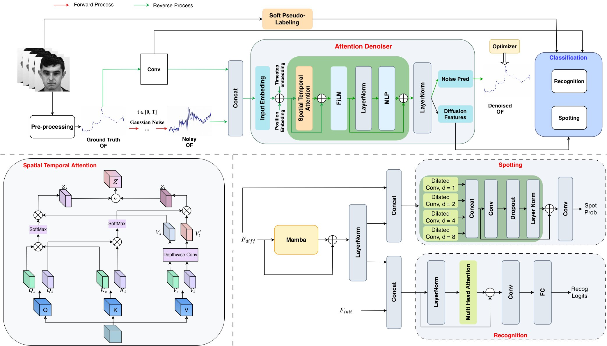

# DiffME: A Diffusion-based Unified Framework with Soft Pseudo-Labeling for Micro-Expression Spotting and Recognition

[](https://cvpr.thecvf.com/)
[](https://pytorch.org/)

Official PyTorch implementation of **"DiffME: A Diffusion-based Unified Framework with Soft Pseudo-Labeling for Micro-Expression Spotting and Recognition"** (CVPR 2026 Workshop).

---

## 📌 Overview

**DiffME** is a novel diffusion-based unified framework designed for joint Micro-Expression (ME) spotting and recognition. By incorporating soft pseudo-labeling, DiffME effectively addresses the challenge of subtle facial movements and imbalanced, noisy annotations in micro-expression datasets such as SAMM Long Videos and CAS(ME)³.

<p align="center">
  
</p>

---

## 🔧 Setup

STEP1: `bash setup.sh`

STEP2: `conda activate DiffME`

STEP3: `pip install -r ./requirements.txt` 


## 💻 Examples of Neural Network Training

STEP 1: Download the SAMMLV/$CAS(ME)^3$ raw data by asking the paper authors

STEP 2: Modify `main.py; load_excel.py; load_images.py`

STEP 3: Run `python main.py --dataset_name CASME_3 --train True`


## 🎓 Acknowledgement

We referred to [ME-TST+](https://github.com/zizheng-guo/ME-TST), and would love to thank them for having shared the code publicly.


## 📜 Citation

If you find this repository helpful, please consider citing:

```
@InProceedings{Ha_2026_CVPR,
    author    = {Ha, Pham Ngoc Thach and Nguyen, Luu Tu and Ha, Le Thanh and Ngo, Thi Duyen},
    title     = {DiffME: A Diffusion-based Unified Framework with Soft Pseudo-Labeling for Micro-Expression Spotting and Recognition},
    booktitle = {Proceedings of the IEEE/CVF Conference on Computer Vision and Pattern Recognition (CVPR) Workshops},
    month     = {June},
    year      = {2026},
    pages     = {1310-1319}
}
```
